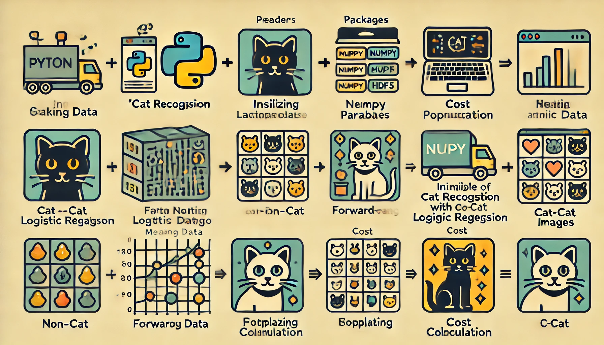

<div style="text-align: center;">
    
</div>


# Cat Recognition with Logistic Regression

## Project Overview

This project implements a logistic regression model to recognize cats in images. The workflow includes data loading and preprocessing, model training, and cost visualization. The aim is to build an efficient cat detector using logistic regression.

## Table of Contents

- [Introduction](#introduction)
- [Project Structure](#project-structure)
- [Installation](#installation)
- [Usage](#usage)
- [Results](#results)
- [Contributing](#contributing)
- [License](#license)

## Introduction

The objective of this project is to create a machine learning model that can accurately identify whether an image contains a cat. We employ logistic regression, a simple yet powerful algorithm for binary classification tasks.

## Project Structure

```
Cat-Recognition-Logistic-Regression/
├── datasets/
│   ├── train_catvnoncat.h5
│   ├── test_catvnoncat.h5
├── images/
│   ├── data_visualization.png
│   ├── cost_plot.png
│   ├── logistic_regression_model.png
├── notebooks/
│   ├── Cat_Recognition_with_Logistic_Regression.ipynb
├── README.md
└── requirements.txt
```

## Installation

1. Clone the repository:

```bash
git clone https://github.com/yourusername/Cat-Recognition-Logistic-Regression.git
cd Cat-Recognition-Logistic-Regression
```

2. Install the required packages:

```bash
pip install -r requirements.txt
```

## Usage

1. Open the Jupyter Notebook:

```bash
jupyter notebook notebooks/Cat_Recognition_with_Logistic_Regression.ipynb
```

2. Run the cells in the notebook to execute the project steps:

   - **Packages**: Install and import necessary libraries.
   - **Load Data**: Load and visualize the cat/non-cat dataset.
   - **Preprocessing**: Normalize and reshape the dataset.
   - **Initialize Parameters**: Set up initial weights and bias.
   - **Helper Functions**: Define utility functions for forward and backward propagation, and optimization.
   - **Model Training**: Train the logistic regression model on the dataset.
   - **Cost Plotting**: Visualize the cost reduction over iterations.

## Results

The model successfully classifies images as cat or non-cat. Key results include:

- **Cost Reduction Plot**: Shows the decrease in cost function over training iterations, indicating the learning progress.
- **Prediction Accuracy**: Achieves high accuracy on both training and test datasets.

## Contributing

Contributions are welcome! If you have suggestions or improvements, feel free to create a pull request or open an issue.

## License

This project is licensed under the MIT License. See the [LICENSE](LICENSE) file for details.

---

Feel free to enhance this README with additional details or sections as needed. If you have any questions or need further assistance, please contact [Khoshbinhooman@gmail.com].
